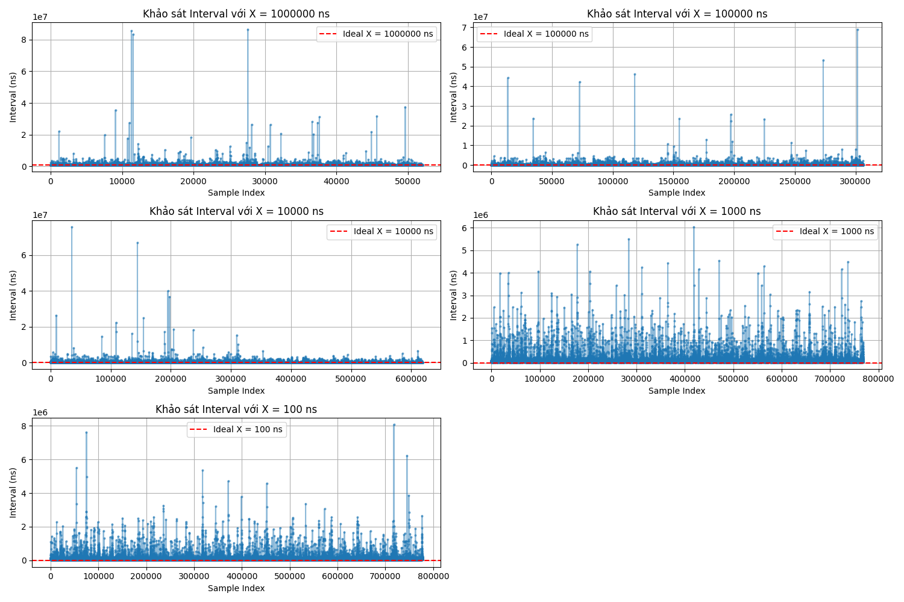

# Linux Programming Assignment: Timer Analysis & Multithreading

[cite_start]Dự án thực hành lập trình Linux mô phỏng hệ thống quản lý đa luồng (Multithreading) và đánh giá độ trễ thời gian (Timer Jitter) trên hệ điều hành Linux[cite: 1, 4, 10]. [cite_start]Dự án thuộc khuôn khổ chương trình đào tạo Nhóm thực tập Nhúng – dự án gNodeB 5G VHT[cite: 2].

---

## 1. Mô tả dự án

[cite_start]Chương trình C bao gồm 3 threads hoạt động song song và được đồng bộ hóa chặt chẽ bằng `pthread_mutex` và `pthread_cond` theo chuẩn POSIX[cite: 4]:

* [cite_start]**SAMPLE Thread:** Thực hiện lặp vô hạn việc đọc thời gian hệ thống hiện tại (chính xác đến nanosecond) vào biến `T`[cite: 5, 6]. [cite_start]Luồng này sử dụng `nanosleep` để nghỉ một khoảng thời gian bằng chu kỳ `X` ns[cite: 5].
* [cite_start]**INPUT Thread:** Định kỳ kiểm tra file `freq.txt`[cite: 7]. [cite_start]Nếu phát hiện giá trị chu kỳ `X` thay đổi, luồng sẽ cập nhật ngay lập tức vào hệ thống[cite: 7]. [cite_start]Người dùng hoặc kịch bản tự động có thể `echo` giá trị vào file này[cite: 7].
* [cite_start]**LOGGING Thread:** Chờ đợi tín hiệu cập nhật từ luồng SAMPLE[cite: 7]. [cite_start]Khi `T` có giá trị mới, luồng sẽ tính toán `interval` (khoảng thời gian giữa biến `T` hiện tại và lần ghi trước) và ghi dữ liệu ra file `time_and_interval.txt` để phục vụ phân tích[cite: 7].

## 2. Cấu trúc thư mục

```text
linux_timer_analysis/
├── Makefile                # Kịch bản biên dịch chương trình C tự động
├── README.md               # Tài liệu mô tả dự án và đánh giá
├── src/
│   └── main.c              # Mã nguồn C (Quản lý 3 threads chuẩn TLPI)
├── scripts/
│   ├── run_test.sh         # Shell script tự động hóa quá trình test (5 phút)
│   └── plot_data.py        # Script Python vẽ đồ thị đánh giá jitter
└── logs/                   # Thư mục chứa dữ liệu đầu ra và ảnh đồ thị
```

## 3. Hướng dẫn sử dụng

### 3.1. Cài đặt môi trường
Đảm bảo hệ thống đã cài đặt `gcc`, `make` và thư viện Python cần thiết:
```bash
pip3 install pandas matplotlib
```

### 3.2. Chạy khảo sát tự động
[cite_start]Sử dụng Shell Script để tự động biên dịch và chạy chương trình trong 5 phút[cite: 8, 10]. [cite_start]Chu kỳ `X` sẽ lần lượt thay đổi qua các mức: 1.000.000 ns, 100.000 ns, 10.000 ns, 1.000 ns, 100 ns sau mỗi 1 phút[cite: 8, 9].
```bash
chmod +x scripts/run_test.sh
./scripts/run_test.sh
```

### 3.3. Vẽ đồ thị
[cite_start]Sau khi hoàn tất quá trình thu thập, chạy script để trực quan hóa kết quả[cite: 10]:
```bash
python3 scripts/plot_data.py
```

## 4. Khảo sát và Đánh giá

[cite_start]Dưới đây là đồ thị biểu diễn giá trị `interval` thực tế so với chu kỳ lý tưởng (đường đứt nét màu đỏ)[cite: 10]:



**Nhận xét:**

* **Về độ ổn định:** Ở các mức chu kỳ lớn ($X \ge 100.000$ ns), hệ thống hoạt động khá ổn định. Tuy nhiên, ở các mức chu kỳ thấp ($X \le 1.000$ ns), xuất hiện sai số cực lớn, các điểm nảy (spikes) vọt lên rất cao so với mức lý tưởng.
* **Nguyên nhân:** Bản chất Linux tiêu chuẩn là hệ điều hành đa nhiệm phân thời (General Purpose OS), không phải hệ điều hành thời gian thực (RTOS). Việc lập lịch cho thread (Scheduler), chi phí chuyển đổi ngữ cảnh (Context Switch), và độ phân giải của timer không thể đáp ứng chính xác tuyệt đối ở mức nanosecond.
* **Kết luận:** Hệ thống hoạt động đúng theo thiết kế đa luồng chuẩn POSIX nhưng bộc lộ rõ hạn chế về tính thời gian thực của Linux khi xử lý các chu kỳ siêu ngắn. Khó có thể yêu cầu hàm sleep ngắt chính xác ở độ phân giải dưới 1 microsecond trên Linux thông thường.
